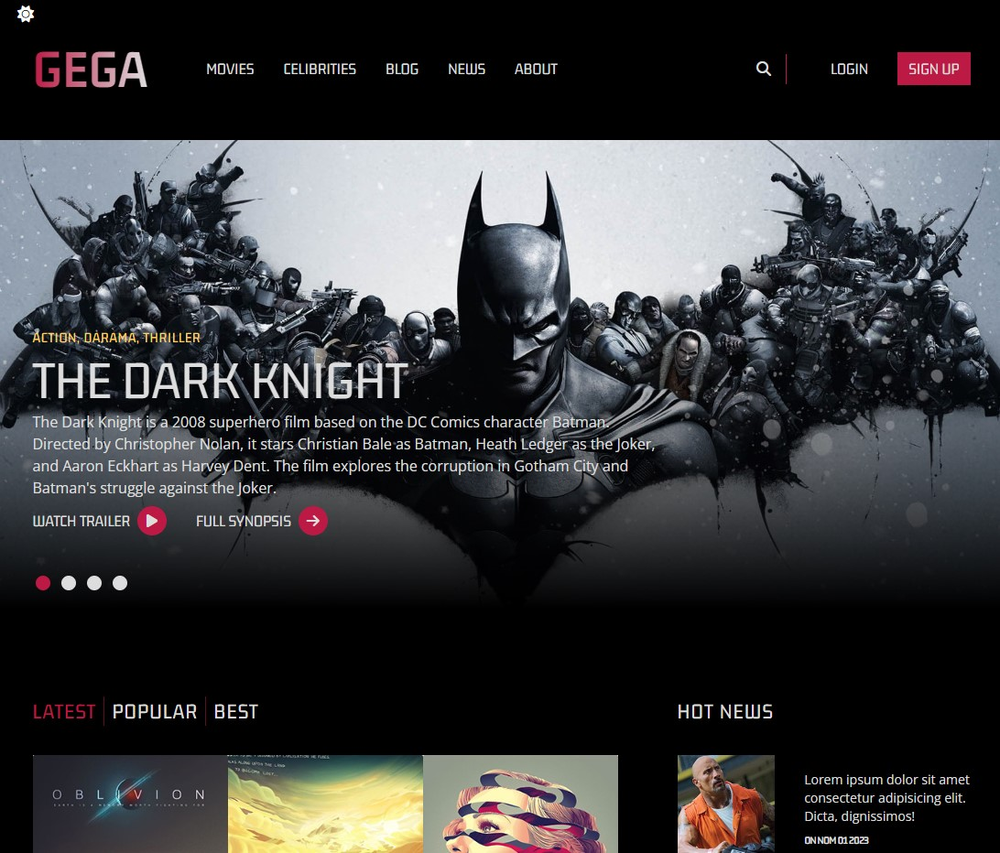

# Tailwind Css Tutorial

---

## Demo : https://gega-project-ziyac.netlify.app/

---

## Project Skeleton

```
|----README.md
├── public
│ ├── css
│ │ └── styles.css
│ ├── images
│ │ ├── batman.jpg
│ │ ├── matrix.png
│ │ ├── mv1.jpg
│ │ ├── mv2.jpg
│ │ ├── mv3.jpg
│ │ ├── mv4.jpg
│ │ ├── mv5.jpg
│ │ ├── mv6.jpg
│ │ ├── new1.jpg
│ │ ├── new2.jpg
│ │ ├── new3.jpg
│ │ ├── new4.jpg
│ │ ├── new5.jpg
│ │ ├── Screenshot.jpg
│ │ ├── usevara1.jpg
│ │ ├── usevara2.jpg
│ │ ├── usevara3.jpg
│ │ ├── usevara4.jpg
│ │ └── usevara5.jpg
│ ├── js
│ │ └── script.js
│ └── index.html
├── .gitignore
├── input.css
├── package-lock.json
├── package.json
└── tailwind.config.js
```

## Author

- Author - [Ziya ÇAYLAN]

## Contact

<p align="center">
<a href="https://codesandbox.io/u/ziyacaylan" target="blank"></a>
<a href="https://codepen.io/ziya-c" target="blank"></a>
<a href="https://www.linkedin.com/in/ziya-caylan/" target="blank"></a>
<a href="https://medium.com/@ziyacaylan" target="blank"></a>
</p>

## Referance

- [Youtube Channel: @arinsoftware]

---


